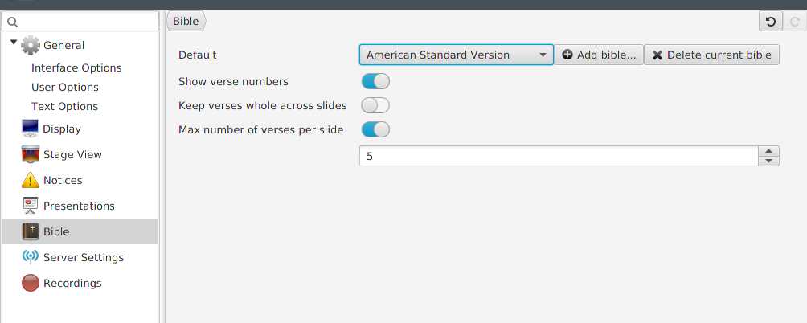
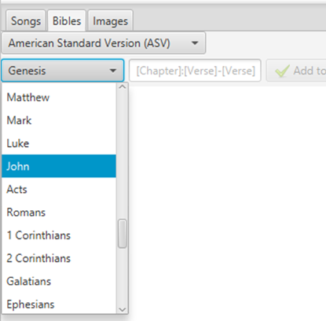
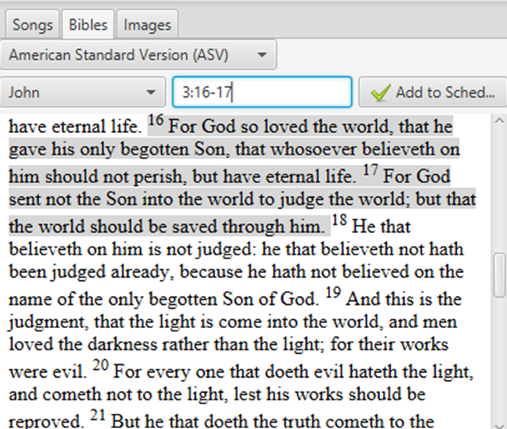
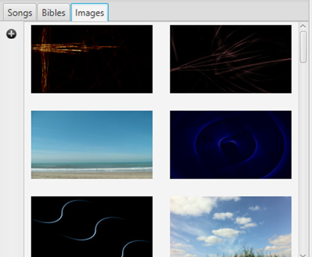
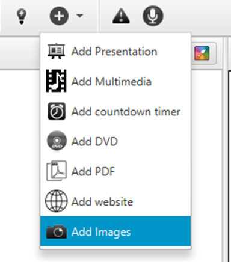
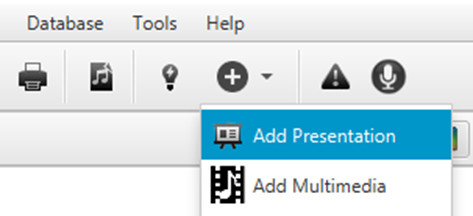
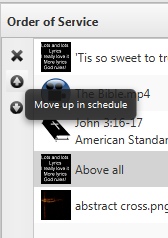

# Adding items to the order of service

The Order of Service, or Schedule, is a way for you to organize multiple
items for a certain occasion, e.g. a service. You can add songs, Bible
passages, images, presentations, timers and videos (from a file on your
computer, from YouTube or from a DVD) and then place them in the order
you would like to have them.

## Adding a song

To add a song to your schedule, start by finding the desired song in
your database. You could either search by title, phrase or author. You
could also scroll through the database to find the desired song. Once
you have found it you have three ways to add it to your Order of
Service: by dragging the song and dropping it in the Order of Service,
by pressing enter on your keyboard or right-clicking and selecting “Add
to schedule”. If you want to make sure that the version that you have in
your database will remain untouched even if you edit the lyrics during
the service, select “Copy to schedule” instead or enable the setting
[Copy song to schedule by
default](Copy_song_to_schedule_by_default "Copy song to schedule by default").

## Adding a Bible passage

To add a Bible passage to your schedule, you start by selecting the
Bible tab. There your [default
Bible](Bible_tab#default-bible-and-add-a-bible "Bible tab") will be
selected, but you are free to select whichever translation you prefer.
(If your preferred translation is not in Quelea by default, read about
how you can add Bible translations at [Default Bible and add a
Bible](Bible_tab#default-bible-and-add-a-bible "Bible tab").)

Next, you select your desired book by scrolling through them or by
writing the first letters of the book. Note that the letters you write
will not be visible but will be remembered as you continue typing.

 

After that, you write the desired chapter and verse, separated with a
colon (:). If you wish to add multiple verses, just separate the first
and the last verse number with a hyphen (-). Not writing a second number
after the hyphen before adding the passage to your schedule will
automatically add the remaining verses of the chapter to the passage. If
you want to add multiple passages from the book at once, just separate
the full passage path with a comma (,) or a semi-colon (;), e.g.
`3:16-17;3:21`.

You can also click the verses to extend/shorten the selected passage. If
you click before or after the selection, the passage is extended to/from
that verse. If you click a verse in the selection, that will become the
first verse of the passage.

Once you have found the desired passage, press enter or click “Add to
Schedule”. (If you later decide you would like to change the Bible
version of the passage, just right-click and select “Switch Version”.)

## Adding an image

To add an image to your schedule, you simply double-click on one of the
images found in the Images tab or drag and drop it into your schedule. If
you wish to add your own images, just click the Plus button on your left
and browse to the desired image.

Alternatively, you could also add images by using the option in the add
menu. This option is explained in detail in the section [Displaying an
image group](Displaying_an_image_group "Displaying an image group").

## Adding multimedia

If you want to add multimedia to your schedule you have two options: 1)
add a video or music file stored on your local computer, or 2) add a DVD
video. Both are found as options under the plus button in the top of the
screen. Simply select your option and browse to the location of the
file/DVD. If you have activated the [Video Library
Tab](General_tab#Show_Video_Library_Tab_\(requires_restart\) "General tab"),
you can also add a video from that tab in a similar way to how you add
images.

## Adding a presentation

To add a presentation you hover the mouse over the add button in the top
of the screen, click the option "Add Presentation" and browse to the
desired presentation stored on your local computer. To set up Quelea to
use OpenOffice Impress or Microsoft PowerPoint for further features, see
the [Presentations tab](Presentations_tab "Presentations tab").

## Organizing a schedule

You can use the small buttons to the left of the schedule to move an
item up or down (arrow buttons) in the schedule or to remove one (X
button).

You can also drag the items around if you prefer.

## Themes

How to set up themes will be [covered further on](Themes "Themes"),
but it might be good for you to know that you can use themes to set up
font, colours, image or video background, text alignments or other
non-standard settings. You find the themes located in the upper right
corner of the Order of Service section; a colourful button.

-----

[← Adding songs to your
database](Adding_songs_to_your_database "Adding songs to your database")
&nbsp;&nbsp;&nbsp;&nbsp;&nbsp;&nbsp;&nbsp;&nbsp;&nbsp;&nbsp;&nbsp;&nbsp;&nbsp;&nbsp;&nbsp;&nbsp;&nbsp;&nbsp;&nbsp;&nbsp;&nbsp;&nbsp;&nbsp;&nbsp; [Showing something live
→](Showing_something_live "Showing something live")

---
