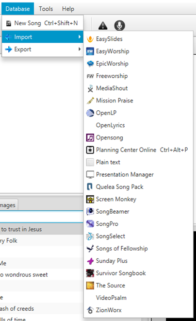
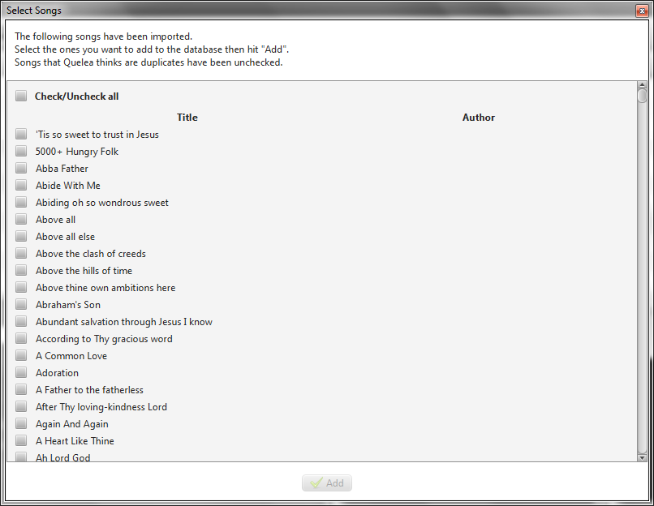

# Adding songs to your database

## Creating a new song

The first time you run Quelea your song database will be empty. A
message will be visible, showing you were to click to add a new song to
the database.

After clicking the button you will see the following dialog where you
can add the name of the song and the author, along with the lyrics. You
might also add chords that you later can use with [Stage
View](Stage_View "Stage View"). Just write the chords above the lyrics and they will automatically be recognized as such and hidden from the main view but visible on the Stage View when you go live with the item. It is also possible to transpose the
chords by clicking the button with the two notes. If you assign labels
to the sections, by using the buttons with a letter on them or by
writing, you will later be able to use keyboard navigation to navigate
through the song (see [Section titles](Section_titles "Section titles")).

After you have added the lyrics, you might also want to add more
information about the song, like CCLI number, Copyright or Year. You
could also add a translation to a song or a separate theme for this
song. For detailed information on how to do that see section 2.
[Additional features](Additional_features "Additional features") or follow the
instructions under the dedicated tabs (Detailed information,
Translations, Theme).

## Importing songs from another software

If you are migrating from another projection software, you might already
have a database of songs that you would like to use. Instead of manually
adding the songs one by one, you can use the Quelea import function.
Quelea supports the import of databases from many of the most common
software among churches, such as EasyWorship, OpenLP, EasySlides and
many others. Simply click on Database, select Import and click on the
source of the database you wish to import.

For this example we will use an EasySlides XML file, but the steps are
similar when you import from another source. The only major exception is
importing through Planning Center Online, so for further instructions on
how to use that feature, check [Planning Center
Online](Planning_Center_Online "Planning Center Online").

If you already have songs in your database and want to make sure Quelea
will not import the songs you already have got, select “Check
duplicates”. Otherwise, or after that, click on the text “Click to
select file” and browse to the location of the database file.

After you have selected the file, the file path will appear. When you
select “Import”, Quelea will start to read the file to see what songs
are stored within the file.

After a while a new dialog will appear, asking you to choose which songs
to import. If you want to import all, just select “Check/Uncheck all”
and click on “Add”.

Once Quelea has finished importing the songs they will appear in your
database and you are now able to [add songs to a
schedule](Adding_items_to_Order_of_Service#adding-a-song "Adding items to Order of Service") and
[showing them live.](Showing_something_live "Showing something live")

-----

[← Setting up a projector](Setting_up_a_projector "Setting up a projector")
&nbsp;&nbsp;&nbsp;&nbsp;&nbsp;&nbsp;&nbsp;&nbsp;&nbsp;&nbsp;&nbsp;&nbsp;&nbsp;&nbsp;&nbsp;&nbsp;&nbsp;&nbsp;&nbsp;&nbsp;&nbsp;&nbsp;&nbsp;&nbsp; [Adding items to Order of Service
→](Adding_items_to_Order_of_Service "Adding items to Order of Service")

---
