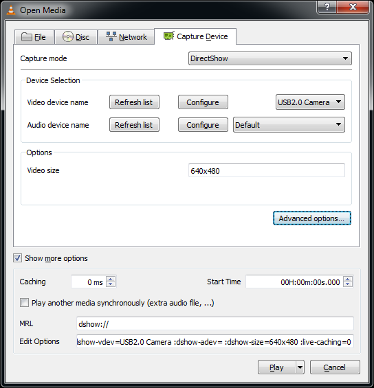

# Advanced settings

Quelea holds a few additional settings that on one hand require a bit
more work from the user to set up, but on the other hand allows you to
fine-tune Quelea for your needs. In the Exodus version there are two of
those settings.

## VLCARG

VLCARG is a new feature that lets you pass argument to VLC, which means
that you can basically adjust the video any way you want. It also means
that you could use live video in Quelea, even as a background video if
you would like, which is what we will cover here. For more options, read
more about it here, and feel free to discuss it at the Quelea forum.

## Using VLCARG to set up live video background

The easiest way is probably to fire up VLC, go to media, and then click
on "Open capture device". You will see something like this:


You can then select whatever you want - for this example we will use the
web camera connected to the computer and set the maximum size to
640x480. Once you are done, hit the "Show more options" checkbox in the
bottom left:



You will see two text fields at the bottom, "MRL" and "Edit Options".
Take note of these values. (You may also want to hit "Play" right away
to make sure these options work - if they don't work in VLC directly
they won't work in Quelea\!)

Next, create a blank text document and open it in notepad (or Notepad++,
or your favourite plain text editor, but not MS Word or the like\!)
Paste the contents of the MRL field into the first line of the text
file, and paste the contents of the "Edit Options" field into the second
line.


Save the file, quit notepad and then change the ".txt" extension to
".vlcarg". Quelea should then pick it up as a video file, and pass on
the MRL and options you specified to VLC directly. This means you can
add the file you just created as a video background (see [Video
background](Themes#video-background "Themes")). Note that Quelea will
save a copy of the file you created in the Quelea video folder, which
means you will need to edit the copied version, not the original that
you created, if you need to change the settings.

## Fade in/out adjustments

Hidden in the Quelea settings file, you will find an option to edit the
fade in/out duration in milliseconds. So if you are not pleased with the
standard duration, start by going to your user folder (in Windows it’s
usually C:\\Users\\ \[username\]\\). There you have to open the folder
named “.quelea” (the dot implies that the folder is hidden in Linux and
OS X, and I won’t cover how you un-hide it or access it anyway here, so
feel free to search the internet for it – there are a lot of tutorials
there). Once you have opened the folder, locate the file called
“quelea.properties”. Open this file in a plain text editor, such as
Notepad (i.e. not MS Word), and look for these three lines (add them if
they are not there): “logo.fade.duration=1000”,
“black.fade.duration=1000” and “clear.fade.duration=1000”.


As you can see Quelea uses one second by default, but you can change the
number to any time you would like Quelea to use when it fades in to
logo, black or clear. A higher number means slower fade (e.g. 2500 = 2.5
seconds) and a lower number means faster (e.g. 500 = 0.5 seconds).

## Margins

Hidden in the Quelea settings file, you will find an option to edit the
margins that Quelea uses when it is projecting. Follow the steps above
to locate the file “quelea.properties” and open it. Add the following
lines and adjust the number to the percentage of the screen you want to
use (0.9 corresponds to
90%).

```
lyric.width.bound=0.9
.height.bound=0.9
```

## Automatically extend projection window to a recently plugged in device

Another setting you can change by editing “quelea.properties” is if you
want the projection screen to be automatically extended when you plug in
a projector. If you know for sure that you will not use Stage View (see
2.8), this might be a good option in case you have a cable with a glitch
or be worried that it might be disconnected in the middle of a service.
Without this option, you always need to set up the [screen output
manually](Display_tab "Display tab").

To enable this feature, add the following line to the properties file.

```
use.auto.extend=true
```

-----


[← Server Settings tab](Server_Settings_tab "Server Settings tab")
&nbsp;&nbsp;&nbsp;&nbsp;&nbsp;&nbsp;&nbsp;&nbsp;&nbsp;&nbsp;&nbsp;&nbsp;&nbsp;&nbsp;&nbsp;&nbsp;&nbsp;&nbsp;&nbsp;&nbsp;&nbsp;&nbsp;&nbsp;&nbsp; [Chapter 5 - Shortcuts and other things that
are good to know
→](Shortcuts_and_other_things_that_are_good_to_know "Shortcuts and other things that
are good to know")

---
