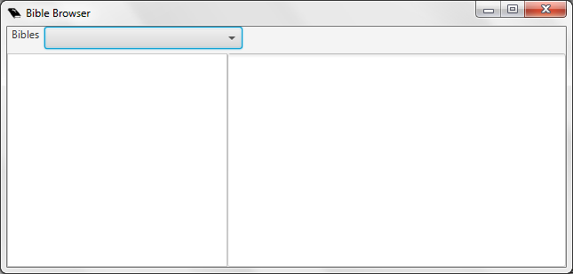

# Bible browser

The bible browser lets you easily browse through entire Bible books. You
find it under Tools and “View bibles...”

Select the desired translation and book and start reading.

-----

[← Bible search](Bible_search "Bible search") &nbsp;&nbsp;&nbsp;&nbsp;&nbsp;&nbsp;&nbsp;&nbsp;&nbsp;&nbsp;&nbsp;&nbsp;&nbsp;&nbsp;&nbsp;&nbsp;&nbsp;&nbsp;&nbsp;&nbsp;&nbsp;&nbsp;&nbsp;&nbsp;
[Saving and sharing schedules
→](Saving_and_sharing_schedules "Saving and sharing schedules")

---
