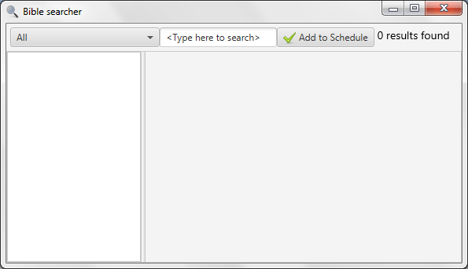
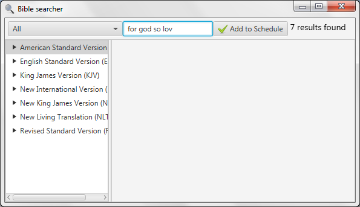
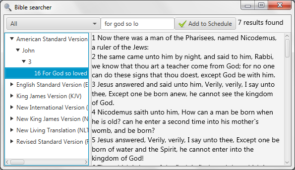

# Bible search

In case you do not know where the Bible passage you want to use is, you
can use the Bible searcher. You find it under Tools and “Search
bibles...”

Here you can search all translations or a single translation by choosing
in the drop-down menu. By default, all Bible translations will be used
in the search. While you type, Quelea automatically searches through the
bibles. You need to write at least four characters for Quelea to start
searching and in the upper right corner you will see the number of
results found.

By clicking a translation, the book that contains the results will
appear. In this example, we start by clicking the America Standard
Version translation and then it shows the books that contain search
results (which is only one here). Clicking a book name shows all
chapters containing a search result and clicking a chapter shows all
verses containing a search result. If only one translation is selected,
instead of “All”, the first step will automatically skipped and the name
of the books will be the base of the tree menu.

Clicking a verse will display the chapter for you to read. If you wish
to add your search result to your schedule, click the “Add to Schedule”
button and the entire chapter will be added. If you only want to add
that verse, you have to do it manually (see [Adding a Bible
passage](Adding_items_to_Order_of_Service#adding-a-bible-passage "Adding items to Order of Service")).

-----

[← Stage View](Stage_View "Stage View") &nbsp;&nbsp;&nbsp;&nbsp;&nbsp;&nbsp;&nbsp;&nbsp;&nbsp;&nbsp;&nbsp;&nbsp;&nbsp;&nbsp;&nbsp;&nbsp;&nbsp;&nbsp;&nbsp;&nbsp;&nbsp;&nbsp;&nbsp;&nbsp; [Bible
Browser →](Bible_Browser "Bible Browser")

---
