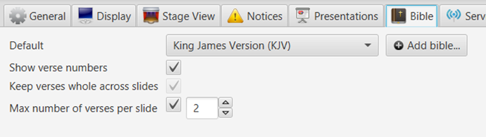

The Bible tab lets you select a default Bible, add a Bible, select
whether or not verse numbers should be displayed in bible passages and
adjust the layout of a Bible passage.

## Default Bible and add a Bible

To set a default browser, simply click the drop-down menu and select one
of the installed bibles. This will later be the default option when you
add a new Bible passage (you might need to restart Quelea for the
changes to take effect).

If you want to add a Bible, click the “Add bible...” button. This allows
you to browse to a downloaded Bible of type XML or XMM. If you wish to
download a Bible, you find XMM bibles in 20 languages here:
<http://www.opensong.org/pages/downloads.html> and XML bibles in 54
languages here:
<http://sourceforge.net/projects/zefania-sharp/files/Bibles/>

Of course; after you have added a Bible, it can also be used as the
default Bible.

## Layout of Bible passages

Your first option is whether or not you want the verse numbers to be
visible or not. By default this is activated and small numbers will be
visible in the beginning of each verse, both in the regular output and
the Mobile Lyrics.

"Keep verses whole across slides" will allow you to determine whether
the text should be divided into slides after a certain amount of words
(to maintain as high font size as possible) or at the end of a verse
after a certain amount of words (to ensure that you will not have to
change slide in the middle of a verse).

The last option overrides the above and allows you to determine how many
verses you would like to display per slide. A higher number usually
means smaller font size, since more text needs to be fitted into the
screen.

-----

[← Notices tab](Notices_tab "Notices tab") &nbsp;&nbsp;&nbsp;&nbsp;&nbsp;&nbsp;&nbsp;&nbsp;&nbsp;&nbsp;&nbsp;&nbsp;&nbsp;&nbsp;&nbsp;&nbsp;&nbsp;&nbsp;&nbsp;&nbsp;&nbsp;&nbsp;&nbsp;&nbsp;
[Server Settings tab →](Server_Settings_tab "Server Settings tab")

---
