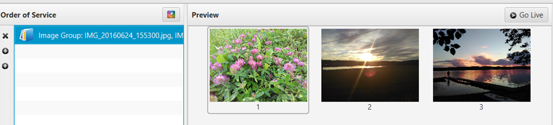

# Displaying an image group

Sometimes you might want to display a group of images rather than one at
the time and to do that you simply select “Add Images” in the add menu
(plus sign) or under the Schedule menu. You can then browse to the
images you want to add. Select multiple images with the selection marker
you get if you click the background and drag the mouse or by holding
`ctrl` and selecting multiple items.

Once you have added them to the schedule, you can use the image group
exactly the same way as [a PDF file](Displaying_a_PDF "Displaying a PDF").

-----

[← Displaying a website](Displaying_a_website "Displaying a website")
&nbsp;&nbsp;&nbsp;&nbsp;&nbsp;&nbsp;&nbsp;&nbsp;&nbsp;&nbsp;&nbsp;&nbsp;&nbsp;&nbsp;&nbsp;&nbsp;&nbsp;&nbsp;&nbsp;&nbsp;&nbsp;&nbsp;&nbsp;&nbsp; [Planning Center Online
→](Planning_Center_Online "Planning Center Online")

---
