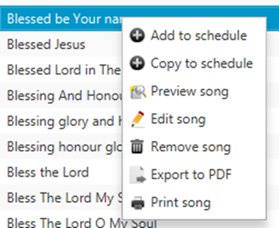

# Exporting or printing a song

In Quelea you can print an individual song or export one to a PDF.
Right-click the desired song in the database (not in the schedule) and
then select either “Export to PDF” or “Print song”. Quelea will then ask
you if you also want to export/print the chords and translation(s) if
there is/are any.

-----

[← Saving and sharing
schedules](Saving_and_sharing_schedules "Saving and sharing schedules")
&nbsp;&nbsp;&nbsp;&nbsp;&nbsp;&nbsp;&nbsp;&nbsp;&nbsp;&nbsp;&nbsp;&nbsp;&nbsp;&nbsp;&nbsp;&nbsp;&nbsp;&nbsp;&nbsp;&nbsp;&nbsp;&nbsp;&nbsp;&nbsp; [Recording →](Recording "Recording")

---
