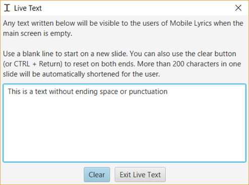
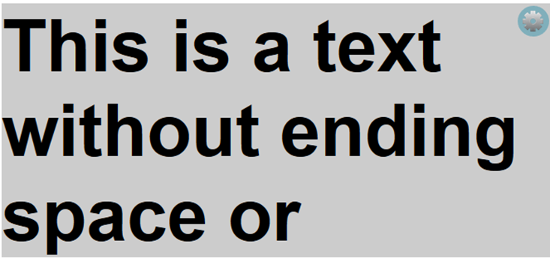

# Live text

Live Text is a feature to use with [Mobile
Lyrics](Mobile_Lyrics "Mobile Lyrics") to send text to the users while you
write. This could for instance be used for written interpretation, to
summarize a sermon for someone with trouble hearing or as a way to send
messages to the worship team if they are the only ones using it.

Start by making sure that the Mobile Lyrics server [is
activated](Mobile_Lyrics#activating-mobile-lyrics "Mobile Lyrics") and then
select Live Text under Tools, or use the keyboard shortcut 
`ctrl` + `shift` + `L`.

The Live Text window will then appear and there you also find
instructions on how to use the feature. For each space or punctuation
character, the text written so far will be sent to the Mobile Lyrics
users automatically. Below you can see how the text above will appear for the users.

-----

[← Planning Center Online](Planning_Center_Online "Planning Center Online")
&nbsp;&nbsp;&nbsp;&nbsp;&nbsp;&nbsp;&nbsp;&nbsp;&nbsp;&nbsp;&nbsp;&nbsp;&nbsp;&nbsp;&nbsp;&nbsp;&nbsp;&nbsp;&nbsp;&nbsp;&nbsp;&nbsp;&nbsp;&nbsp; [Chapter 4 - Setting up Quelea for your needs →](Setting_up_Quelea_for_your_needs "Setting up Quelea for your needs")

---
