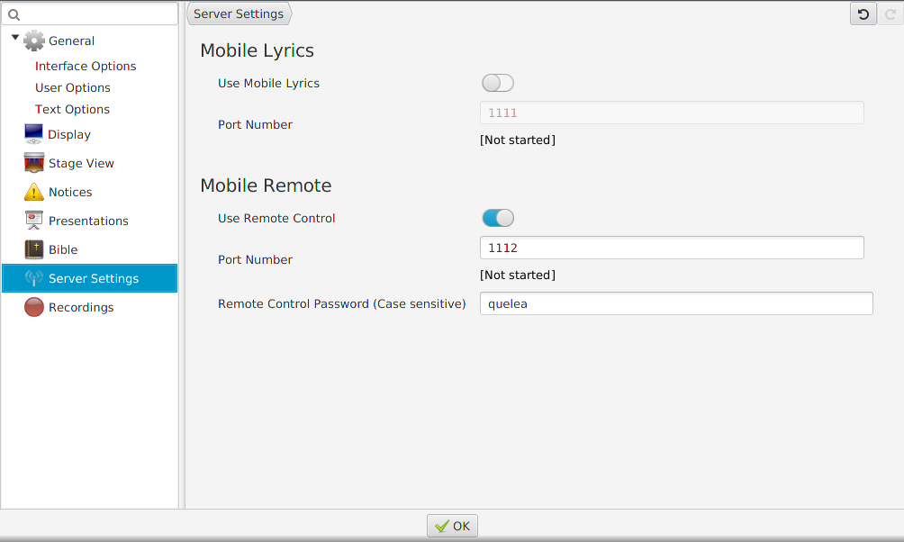
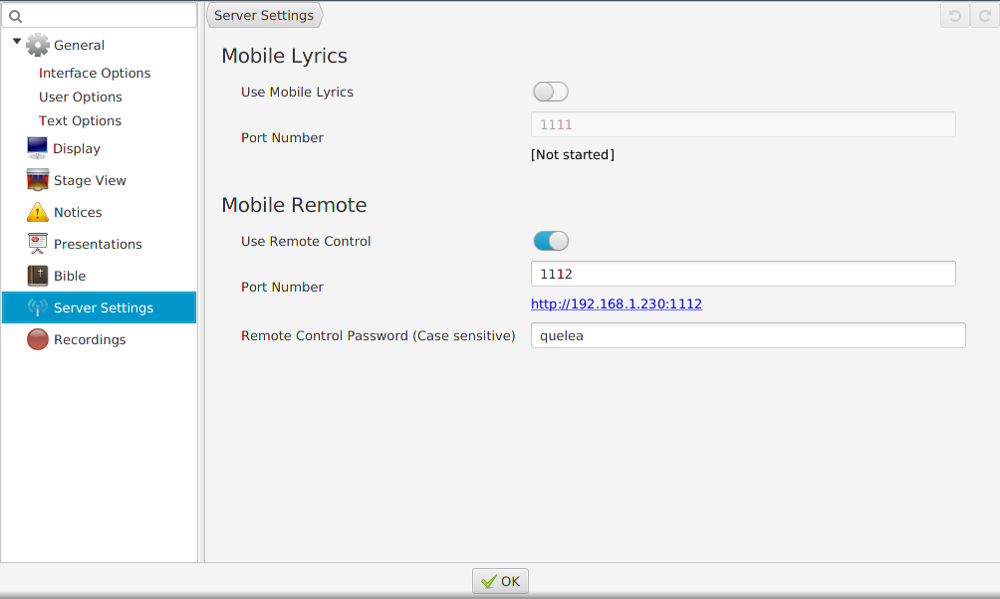
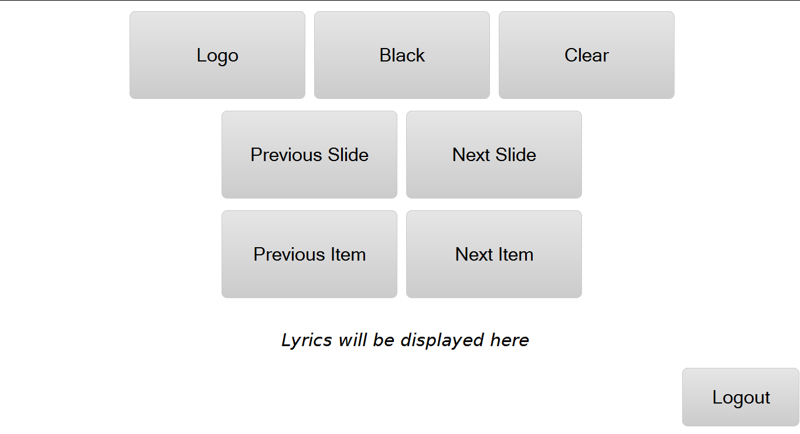

# Mobile remote

Mobile Remote allows you, via a web browser, to control Quelea on any
device connected to the same network as Quelea. This means that Quelea
could be operated e.g. from stage, even if the computer with Quelea is
located elsewhere. This is achieved either through a web browser or one
of the Android applications [Quelea Mobile
Remote](https://play.google.com/store/apps/details?id=org.quelea.mobileremote)
or [Quelea Stage
Mode](https://play.google.com/store/apps/details?id=org.quelea.stagemode)
available in the Google Play Store.

## Activating Mobile Remote

In Options, under the tab Server Settings, you find the option to
activate Mobile Remote server. Note that you will need to be connected
to a network for this feature to work. You should also choose a
password. Note that it is case sensitive, which means that “Quelea” is
not the same as “quelea”. This cannot be left blank.

After you have activated the server, you will need to restart Quelea for
the changes to take effect.

Once you have restarted Quelea, a URL to the Quelea server will appear.
The URL consists of the specific address your computer has in the network
(usually automatically distributed by a router) and a port number that
specifies what the web browser should connect to when it contacts your
computer – in other words: the Quelea Mobile Remote server. This port
number can be changed if something other than Quelea already would use
the suggested port, but for most cases it is best to use the pre-defined
value.

Now the remote control feature is activated, and all you need to do is
visit the URL generated by Quelea from any unit with web browsing
capabilities (as long as it is connected to the same network) to be able
to use it. This means that you could use any smartphone, tablet, laptop
or other portable devices that is connected to the same network as a
remote control. If you have an Android device, you can also download the
applications Quelea Mobile Remote or Quelea Stage Mode to control the
software.

## Using Mobile Remote

When you visit the web page you will (after you have logged in) see
buttons for fading into a logo, to black and the theme background,
buttons for changing slides and items, information about the current
item, the lyrics and a logout button.

When you display a song live, the lyrics will also appear at the Mobile
Remote web page. There you can use it similarly to how you would in the
live section of Quelea; you can click the lyric sections to change
slides. You cannot use the keyboard’s arrow keys, but instead you can
use the dedicated buttons on the web page to change slides.

-----

[← Mobile Lyrics](Mobile_Lyrics "Mobile Lyrics") &nbsp;&nbsp;&nbsp;&nbsp;&nbsp;&nbsp;&nbsp;&nbsp;&nbsp;&nbsp;&nbsp;&nbsp;&nbsp;&nbsp;&nbsp;&nbsp;&nbsp;&nbsp;&nbsp;&nbsp;&nbsp;&nbsp;&nbsp;&nbsp;
[Notices →](Notices "Notices")

---
