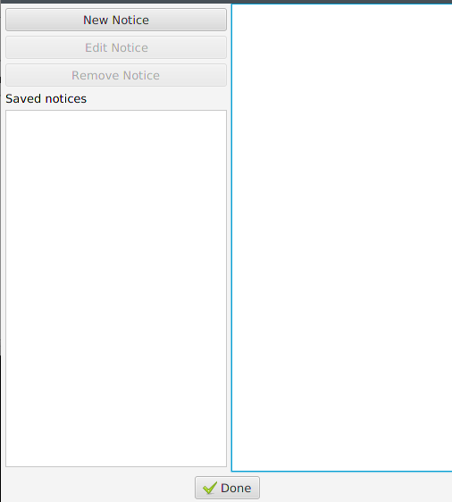
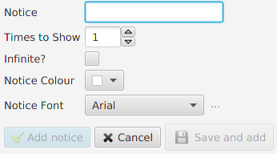
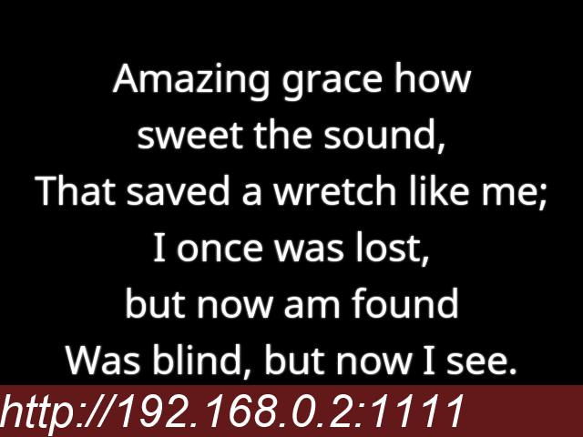

# Notices

Notices is a feature to quickly display messages above other items. You
find where to add new ones by clicking the triangular alert button.

The notices window is rather basic: New Notice, to add a new one; Edit
Notice, to edit one that already is being displayed; and Remove Notice,
to remove a notice that is being displayed. Below the buttons you find a
list where stored notices will appear.

When you want to add a notice, this is what you will see. First you need
to write the notice (the message that you want to display). Secondly you
need to decide whether you should display it a certain amount of times
or if it should stay active until you delete it (`Infinite?`). Lastly
you can set up the font and colour of the notice. (For further notice
settings, see [Notices
tab](Setting_up_Quelea_for_your_needs#notices "Setting up Quelea for your needs"))

Once you click “Add notice” a red bar will appear at the bottom of your
projection (regardless of item showing) with the notice scrolling from
right to left (in this example, the Mobile Lyrics URL). You can also click
"Save and add" to start displaying the notice but also store it for later
usage.

To re-use a notice you have previously stored, just click the notice in
the list "Saved notices" and the add dialog will appear preloaded with
the notice data. If you click "Save and add" again, it will this time
overwrite the stored notice, not add a new one.

-----

[← Mobile Remote](Mobile_Remote "Mobile Remote") &nbsp;&nbsp;&nbsp;&nbsp;&nbsp;&nbsp;&nbsp;&nbsp;&nbsp;&nbsp;&nbsp;&nbsp;&nbsp;&nbsp;&nbsp;&nbsp;&nbsp;&nbsp;&nbsp;&nbsp;&nbsp;&nbsp;&nbsp;&nbsp;
[Stage View →](Stage_View "Stage View")

---
