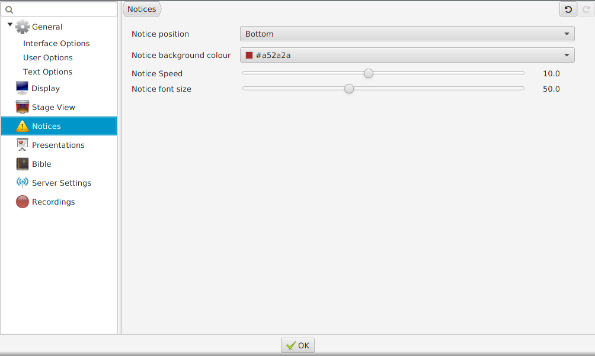

# Notices tab

This tab lets you choose your own settings for the notices. You can
change placement on screen, background colour, the notice speed and the
font size. Below you see the standard settings. If you wish to change
the speed of the notices, sliding the knob to the right means faster and
left slower. For font size, right means bigger and left means smaller.
The changes will be saved once you click OK and will be applied to the
next notice you add (i.e. any notices already being displayed when you
change the settings will not be affected).

-----

[← Stage View tab](Stage_View_tab "Stage View tab")
&nbsp;&nbsp;&nbsp;&nbsp;&nbsp;&nbsp;&nbsp;&nbsp;&nbsp;&nbsp;&nbsp;&nbsp;&nbsp;&nbsp;&nbsp;&nbsp;&nbsp;&nbsp;&nbsp;&nbsp;&nbsp;&nbsp;&nbsp;&nbsp; [Presentations tab
→](Presentations_tab "Presentations tab")

---
