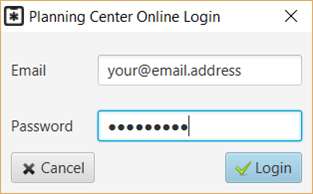
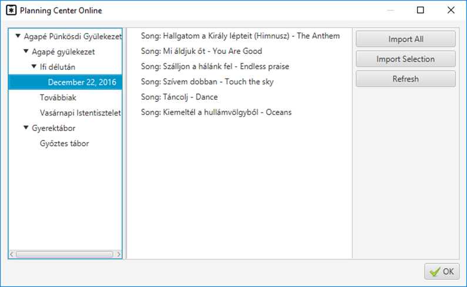

# Planning center online

If you have an account at Planning Center Online, you can import your
data from their server into Quelea. First, make sure you have setup a
[download path for additional files](Import_Export "Import Export"). Then,
sign in to Planning Center Online by going to Database -\> Import -\>
Planning Center Online, or by pressing the keyboard shortcut ctrl + alt
+ p.

Once you have logged in, you can select what you want to import.

-----

[← Displaying an image group](Displaying_an_image_group "Displaying an image group")
&nbsp;&nbsp;&nbsp;&nbsp;&nbsp;&nbsp;&nbsp;&nbsp;&nbsp;&nbsp;&nbsp;&nbsp;&nbsp;&nbsp;&nbsp;&nbsp;&nbsp;&nbsp;&nbsp;&nbsp;&nbsp;&nbsp;&nbsp;&nbsp; [Live Text →](Live_Text "Live Text")

---
