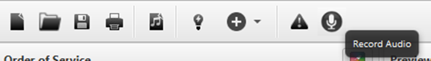

A new feature since Quelea 2016.0 is recording ability. This can for
instance be used to record sermons or entire services. To use the
recording feature, you first need to set up the recording location.
Start by going to Options, the Recordings tab and click Browse, next to
“Path for recordings”. Browse to the folder where you would want the
recordings to be stored.

To start a recording, just click the recording button with a microphone
at the top of the screen.

The recording button will then be pushed down and the elapsed time and a
textbox containing the default name will appear.

If you want to change the name of the recording, just edit the text to
whatever you want to call it.

Simply press the button again to stop recording. The recording will
automatically be stored in the recordings path and if you have enabled
VLC converting (see 3.1.7), your file will automatically be stored as a
MP3 and the default WAV file will be deleted.

-----

[← Exporting or printing a
song](Exporting_or_printing_a_song.md "Exporting or printing a song")
&nbsp;&nbsp;&nbsp;&nbsp;&nbsp;&nbsp;&nbsp;&nbsp;&nbsp;&nbsp;&nbsp;&nbsp;&nbsp;&nbsp;&nbsp;&nbsp;&nbsp;&nbsp;&nbsp;&nbsp;&nbsp;&nbsp;&nbsp;&nbsp; [Timer →](Timer.md "Timer")

---
