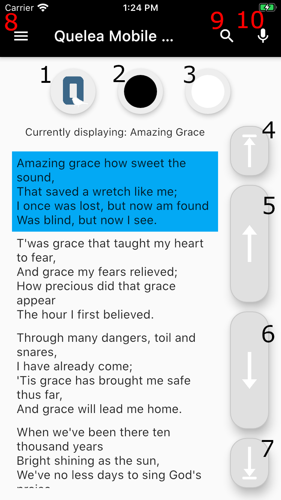
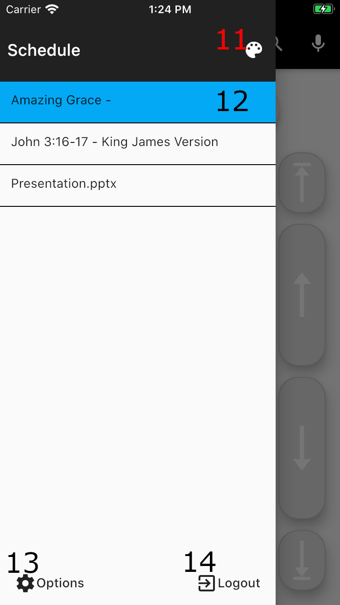

# Remote Control Manual

To be able to use the app you need [Quelea](https://quelea.org) to be installed on a computer. Before you are able to use the app, you first need to connect to the server. If you have problems getting started, you can follow the [troubleshooting guide](Remote_Control_Troubleshooting).

## Basic layout

### Toggle buttons
#### 1. Logo button
Hide the current output and display a [pre-defined logo](Logo).

#### 2. Black button
Hide the current output with a black screen.

#### 3. Clear button
Hide the text and keep any [background](Themes) that is set up.

### Navigation buttons
#### 4. Previous item
Go to the previous item in the schedule.

#### 5. Previous slide
Go to the previous slide in the active item.

#### 5. Next slide
Go to the next slide in the active item.

#### 7. Next item
Go to the next item in the schedule.

### App bar buttons

#### 8. Schedule menu
Open the schedule drawer.

#### 9. Search button
Add a song or a Bible passage.

#### 10. Toggle recording
Start/stop an audio recording. [Must first have been set up on the server](Recording).

## Drawer layout

#### 11. Themes button
Open the dialog for setting the global theme.

#### 12. Schedule item
A schedule item can be tapped to be selected or long-pressed to open up a menu for moving or removing the item. Blue background means that the item currently is live, grey means that the item is in the preview panel of the server.

#### 13. Options button
Open up the options window. See [Options](#options) for an explanation of the different settings.

#### 14. Logout button
Logs you out of the server and will cause a dialog to open that asks you to enter the password again.

## Features
Here's a quick overview of the features.

### Navigate through a song
Navigate through the song by using the [navigation buttons](#navigation-buttons) or by clicking the section you want to show live. You can also use [the keyboard shortcuts](#keyboard-shortcuts). If you use an Android device you can also activate [volume navigation](#volume-navigation).

### Hide text
Hide the text with any of the [toggle buttons](#toggle-buttons). If you use an Android device you can also set up [volume button actions](#volume-navigation) for hiding the text.

### Record
You can start/stop a recording through the app. However, you need to set it up on the server first. If you want to rename the file you also need to do it on the server.

### Search
When you click the search button you first need to select if you want to add a Bible passage or search for a song:

#### Add a Bible passage
1. First select the Bible translation you want to use.
2. Select the Bible book.
3. Select chapter (the leftmost number list), the starting verse (the middle list) and ending verse (the rightmost list). The text will automatically update which passage currently is selected.
4. Click 'Add' or 'Add and go live'.
5. A snack bar will appear with a message if adding the passage was successful or not.

#### Add a song
1. Start writing the song title or a part of the song lyrics, and the found entries will soon appear.
2. Click the song you want to preview or add live.
3. Select 'Add' or 'Add and go live'.

### Select theme
1. Open the schedule drawer.
2. Click the theme button.
3. Click the theme you want to use as a global theme.
4. A snack bar will appear to verify the theme change.

__Note__: The theme will not change on the projection until you change either the slide or the item.

## Options
### Server Settings
#### Remote Control URL
Here you can manually set the URL.

#### Automatically try to find the server URL
All devices on the network will be pinged to see if it gives the proper response. This should give a result rather quickly if the server is started. 

Might cause issues if there would be two instances of Quelea on the same network or if it's run on a older device. Disable this in that case.

### Navigation Settings
#### Swipe navigation
If you enable this you can change either item or slide by swiping left or right.

#### Volume navigation 
*Android only* 

Use the volume rocker to navigate through an item's slides. If this is activated, it also enables you to set the following settings.

##### Long-click action
*Needs [Volume navigation](#volume-navigation) to be active*

Select an action for when you long-press a volume button.

##### Double-click action
*Needs [Volume navigation](#volume-navigation) to be active*

Select an action for when you press both volume buttons at the same time.

## Keyboard shortcuts

| Shortcut | Action |
| --- | --- |
| 1-9 | Navigate to a certain slide number if no section titles are found (Android) |
| Ctrl + 1-9 | Navigate to a certain slide number (iOS) |
| Up/Down | Go to next/previous slide |
| Page Up/Page Down | Go to next/previous slide |
| Ctrl/Command/Alt + Up/Down | Go to next/previous item |
| Ctrl/Command/Alt + Page Up/Page Down | Go to next/previous item |
| Shift + Left click | Quickly edit text in a slide |
| F5 | Fade into/out of logo |
| F6 | Fade into/out of black |
| F7 | Hide/display lyrics and show background or enter spell check inside of song editor |
| Ctrl + R | Start/stop recording |
| Ctrl + D | Open schedule drawer (Android) |
| Ctrl + L | Open search dialog (Android) |
| Ctrl + T | Open settings (Android |
| C | Navigate to section title 'Chorus' if found (Android) |
| B | Navigate to section title 'Bridge' if found (Android) |
| P | Navigate to section title 'Pre-chorus' if found (Android) |
| T | Navigate to section title 'Tag' if found (Android) |
| I | Navigate to section title 'Intro' if found (Android) |
| O | Navigate to section title 'Outro' if found (Android) |
| 1-9 | Navigate to section title 'Verse (number)' if found (Android) |
