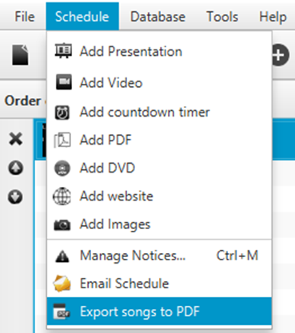

Quelea can save a schedule for later use, help you print one or email
one to a friend. To save a schedule that you have
[created](Adding_items_to_Order_of_Service.md "Adding items to Order of Service"), click “File” and
“Save Schedule” or “Save Schedule as...” If you have opened an existing
file, the latter will always let you save changes to a new schedule
whereas the first will save the changes to the same file as when it was
created. The first time you click any of them however, they will both
let you create a file that contains your schedule. Quelea saves all
information to the file, so even if your database would be deleted or
you would send it to another user, everything will still be accessible.
If you do not want to embed media resources (to reduce the file size),
see [make sure it is
deactivated](General_tab.md#embed-media-in-schedule-file "General tab").

Printing a schedule allows you to print the order of service, not the
lyrics of a song or the text of a Bible passage. The same goes for
exporting a schedule to a PDF.

If you would like to export all songs (with lyrics) to PDF files, you
click “Schedule” and “Export songs to PDF”. The songs will then be
exported as a compressed Zip file that you first will have to decompress
if you want to reach the PDF files.

To email a schedule via Quelea, you click “Schedule” and “Email
Schedule”. That opens a new email in your system's default email
software. If you wish to use another email client, you will have to
attach the file manually.

This is what the email contains. The subject will be “Quelea schedule”.

-----

[← Bible Browser](Bible_Browser.md "Bible Browser") &nbsp;&nbsp;&nbsp;&nbsp;&nbsp;&nbsp;&nbsp;&nbsp;&nbsp;&nbsp;&nbsp;&nbsp;&nbsp;&nbsp;&nbsp;&nbsp;&nbsp;&nbsp;&nbsp;&nbsp;&nbsp;&nbsp;&nbsp;&nbsp;
[Exporting or printing a song
→](Exporting_or_printing_a_song.md "Exporting or printing a song")

---
