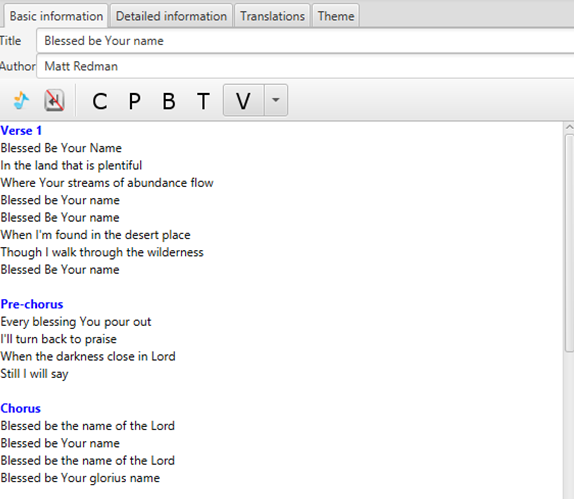

In all songs you can add a title to each section of the lyrics. Just
click the buttons to insert a title or write the title above the section
and it will turn blue if it is recognized as a title. The available
titles at the moment are:

  - Chorus
  - Verse (optionally followed by a number)
  - Pre-chorus
  - Bridge
  - Tag
  - Interlude
  - Ending

The tags will then be visible in the preview and live panel and you can
quickly jump to a section by using the first letter of each title or the
corresponding number of the verse that you want to display, i.e. ‘C’ for
chorus and ‘2’ for the second verse.

-----

[← Timer](Timer.md "Timer") &nbsp;&nbsp;&nbsp;&nbsp;&nbsp;&nbsp;&nbsp;&nbsp;&nbsp;&nbsp;&nbsp;&nbsp;&nbsp;&nbsp;&nbsp;&nbsp;&nbsp;&nbsp;&nbsp;&nbsp;&nbsp;&nbsp;&nbsp;&nbsp; [Displaying a
PDF →](Displaying_a_PDF.md "Displaying a PDF")

---
