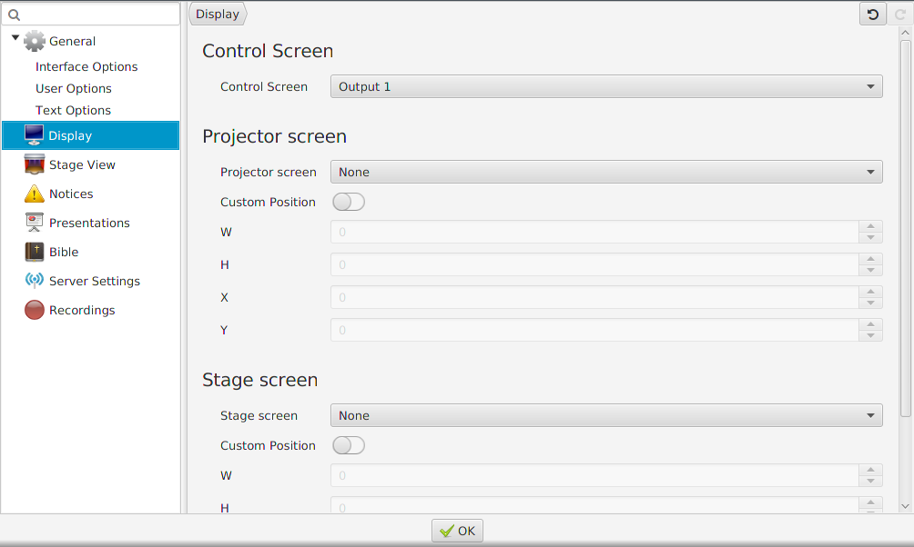

# Setting up a projector

## Selecting output

For Quelea to know where you would like to display the output, you must
set up what screens you use. To access the settings, go to Tools and
Options or press keyboard shortcut Ctrl+T (⌘+T on Mac). Select the tab
Display. For most users, the appropriate setting would be to change
Projector screen to Output 2 and press OK. (If the black projector
screen now would appear on your computer, try changing the output
again.) Note that you might not see a second output if the screen is cloned
unto you projector rather than extended (see
[Troubleshooting](Troubleshooting "Troubleshooting")). If you are an advanced
user and want an automatization of these steps, you could check out
[Advanced settings](Advanced_settings "Advanced settings").

## Using Test Patterns to adjust projector settings

If you manually need to adjust the output colours, size or other visual
settings on your projector you might want to use Test Patterns: images
created to simplify the adjustments. To find out how you adjust your
projector you must consult your product manual. To find the images, go
to Tools and Test Patterns. When you select an image, it will appear on
your projector output that you set up in the previous step.

-----

[← Layout](Layout "Layout") &nbsp;&nbsp;&nbsp;&nbsp;&nbsp;&nbsp;&nbsp;&nbsp;&nbsp;&nbsp;&nbsp;&nbsp;&nbsp;&nbsp;&nbsp;&nbsp;&nbsp;&nbsp;&nbsp;&nbsp;&nbsp;&nbsp;&nbsp;&nbsp; [Adding songs
to your database →](Adding_songs_to_your_database "Adding songs to your database")

---
