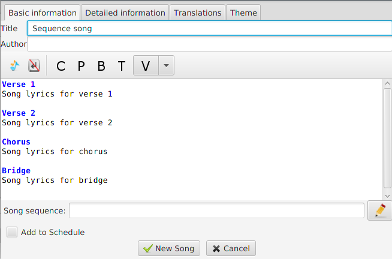
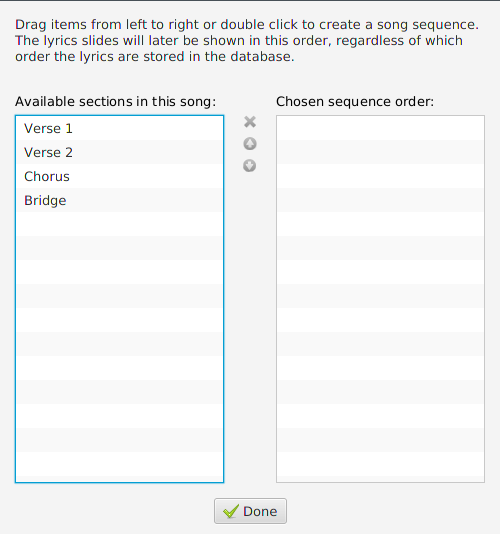
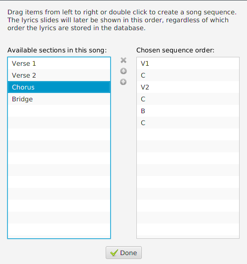
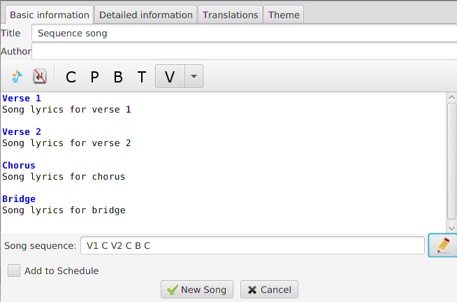
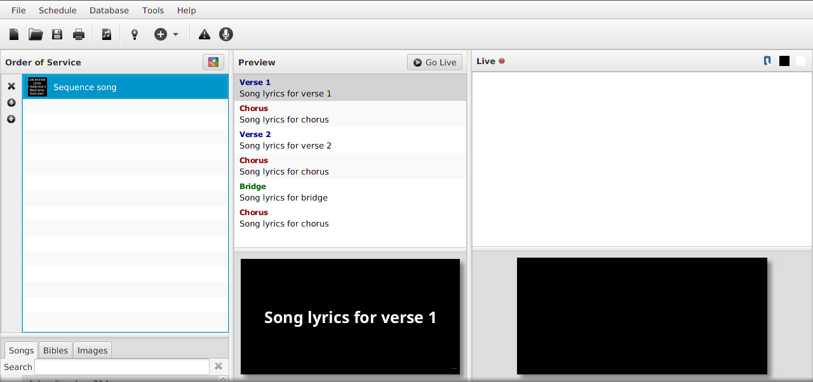

# Song sequences

As of Quelea 2020.0, you can set a sequence order of the lyrics
to avoid having to write the same section several times, e.g. a chorus.

First make sure you have added [section titles](Section_titles.md "Section Titles") 
to the song sections you have entered. This will later be picked up by Quelea.

If you click the pen button next to the song sequence text box, a dialog will appear.

Here all the sections found in the song will be in the list to the left, and 
in the list to the right you could add the sequence you want the song to be
displayed in. Drag and drop or double-click the section you want to add to the
list. You can also drag and drop a section or use the arrow buttons to rearrange 
the order. If you want to delete a section, drag it out from the list to the right
or use the `x` button.

When you are finished, the sequence will be visible in the text box below the lyrics. 
You could also enter these abbreviations to the section text box manually if you 
would prefer that.

The song will then be arranged in that sequence order when it is in the 
preview/live panel.

