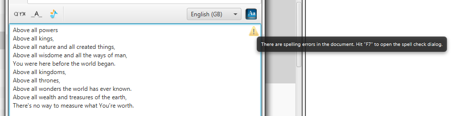
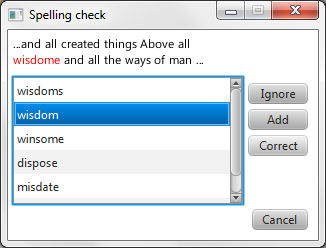

# Spelling check

If you misspell a word, Quelea will automatically find it as long as you
have selected the right language for the song. If a spelling error is
found, a yellow triangle will appear in the upper right corner, telling
you that there is at least one error in the lyrics. By clicking the “Aa”
button that looks like a book, or by hitting F7 on your keyboard, you
can access the spell checker.

Here you can change the misspelled word to one of the suggestions by
selecting the desired suggestion and then clicking “Correct”, make the
spell checker ignore the word for this song by clicking “Ignore”, add
the word to the dictionary by clicking “Add” or manually correct it by
clicking “Cancel”. Once you have clicked Ignore, Add or Correct, the
spelling checker will automatically find any other spelling errors for
you.

-----

[← Logo](Logo "Logo") &nbsp;&nbsp;&nbsp;&nbsp;&nbsp;&nbsp;&nbsp;&nbsp;&nbsp;&nbsp;&nbsp;&nbsp;&nbsp;&nbsp;&nbsp;&nbsp;&nbsp;&nbsp;&nbsp;&nbsp;&nbsp;&nbsp;&nbsp;&nbsp; [Translations
→](Translations "Translations")

---
