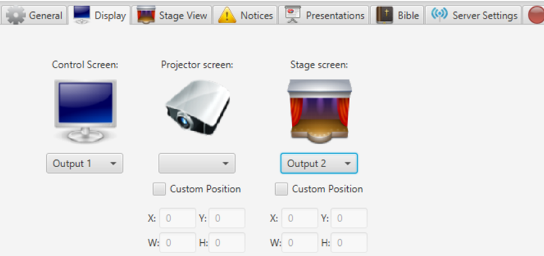
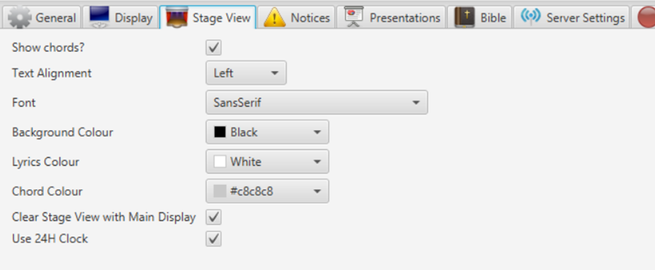

If your computer supports several displays and you have the possibility
to have a monitor on stage, the Stage View feature can allow you to
display additional information to that screen, apart from what currently
is being displayed on the main projection. Currently there are two
features available by default for the Stage View: clock and chords. The
main idea behind the stage view is that it can be used for worship
leaders, hence the chord feature. With that idea in mind, Stage View is
meant to be less “cluttered” and therefore presentations, notices and
videos will not be visible on the Stage View. To be able to control
Quelea from a stage screen and for some additional features, check out
the Android application [Quelea Stage
Mode](https://play.google.com/store/apps/details?id=org.quelea.stagemode)
in the Google Play Store.

## Setting up Stage View

First, enter Options that you find under Tools. Go to the tab Display
and activate the Stage screen. Preferably, you would have three outputs,
one for each screen, but that depends on your graphics card. If you have
three outputs, you need to try them to find which screen you want to use
for what.

Secondly, go to the tab Stage View. Here you can set up whether or not
to use chords, how the text will align, font and colours for background,
lyrics and chords. Clock is not an optional feature, although you can
change if you want a 24 hour clock or not. You can also select whether
or not the Stage View should be cleared when the Main Display is
cleared.

This is an example of what the stage monitor will display if no settings
are changed.

-----

[← Notices](Notices.md "Notices") &nbsp;&nbsp;&nbsp;&nbsp;&nbsp;&nbsp;&nbsp;&nbsp;&nbsp;&nbsp;&nbsp;&nbsp;&nbsp;&nbsp;&nbsp;&nbsp;&nbsp;&nbsp;&nbsp;&nbsp;&nbsp;&nbsp;&nbsp;&nbsp; [Bible
search →](Bible_search.md "Bible search")

---
