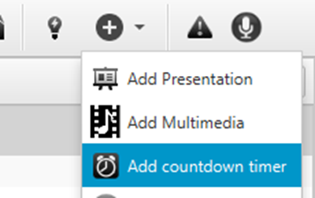
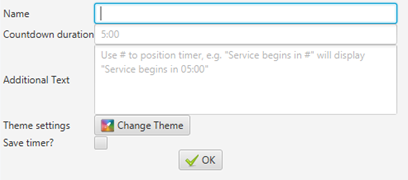
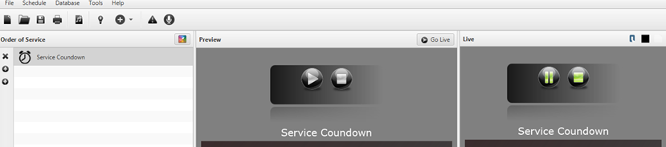

# Timer

If you want a countdown timer to display, for instance with minutes
until the service will start, you can select “Add countdown timer” under
the add menu at the top of Quelea.

You will then be prompted with a dialog where you can set up your new
timer.

Start by writing the duration of the timer. Write the amount of minutes
followed by a colon (:) and then the amount of seconds, e.g. `5:00`. If
you would like to add a message that should be visible along with the
timer, you can write it in the Additional Text box, as long as you
remember to write a hash symbol (\#) where you would like the timer to
be visible. An example is “Service begins in \#”, where the hash
automatically will be replaced with your timer. You could also set up a
separate theme for the timer (see [Setting up a
theme](Themes#setting-up-a-theme "Themes")). Lastly, a timer can then
be saved and later be accessed through the Timer tab.

The timer will then resemble a video, which you can play, pause and stop
if you want to. When you click “Go live”, the timer will automatically
start.

-----

[← Recording](Recording "Recording") &nbsp;&nbsp;&nbsp;&nbsp;&nbsp;&nbsp;&nbsp;&nbsp;&nbsp;&nbsp;&nbsp;&nbsp;&nbsp;&nbsp;&nbsp;&nbsp;&nbsp;&nbsp;&nbsp;&nbsp;&nbsp;&nbsp;&nbsp;&nbsp; [Section
titles →](Section_titles "Section titles")

---
