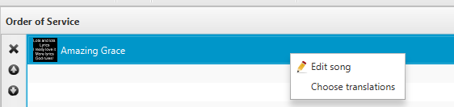
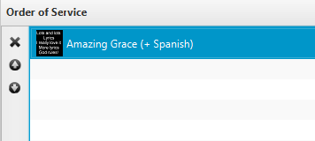
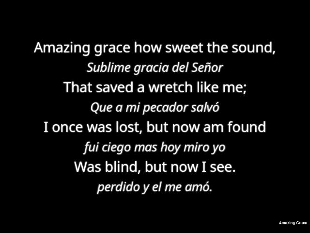

# Translations

Since Quelea 2014 Exodus it is possible to use translations of songs.
You can store many translations to a song, but at the moment only
display one at the time.

## Add a translation

To add a translation, you need to edit a song (by right-clicking a song
and selecting “Edit song”). One of the tabs in that window is called
“Translations”.

On the left side you see the default translation: the lyrics added in
the tab Basic information. On the right side you see the space where the
translations will be added. To add a translation to a song, press the
star button in the upper right corner.

First, you are asked to enter the name of the language to which you
would like to add a translation. If this is spelled correctly and the
setting [Attempt to auto-translate
songs](General_tab#attempt-to-auto-translate-songs "General tab") is
checked, an automatic translation will be added to your song that you
later can edit. (There are no guarantees that the automatic translation
will be entirely accurate, so you are advised to always check the
translation first before using it live).

In this example, the song is automatically translated to Spanish. As
Spanish speakers will see, this would need to be edited. To edit, simply
select the text and write.

Any further added translations will be added as new tabs next to the
first one.

## Show a translation

To show a translation, you need to add a song with at least one
translation to the schedule, then right-click it and select “Choose
translations”.

Then you will be prompted with a dialog that allows you to select the
translation you would like to display. It is only possible to display
one translation (apart from the default lyrics) at the time.

In the schedule, you can see that a translation to the song has been
selected by the text within the parenthesis.

When you [display the song live](Showing_something_live "Showing something live"),
every other line will be the translated version. By default, the
translation will be smaller and italic, but the font appearance can be
changed within the [theme
settings](Themes#setting-up-a-theme "Themes"). With [Mobile
Lyrics](Mobile_Lyrics "Mobile Lyrics") each user can select to view its own
language.

-----

[← Spelling check](Spelling_check "Spelling check")
&nbsp;&nbsp;&nbsp;&nbsp;&nbsp;&nbsp;&nbsp;&nbsp;&nbsp;&nbsp;&nbsp;&nbsp;&nbsp;&nbsp;&nbsp;&nbsp;&nbsp;&nbsp;&nbsp;&nbsp;&nbsp;&nbsp;&nbsp;&nbsp; [Mobile Lyrics
→](Mobile_Lyrics "Mobile Lyrics")

---
